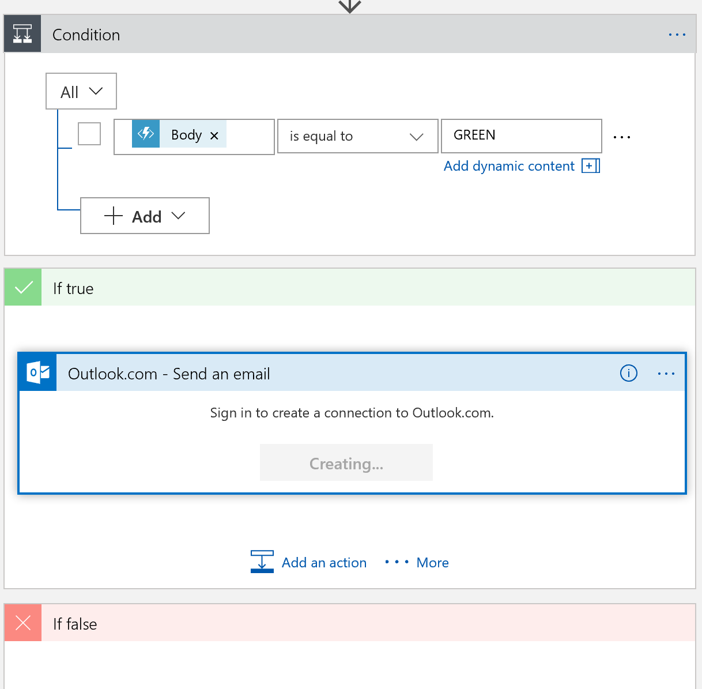

# Create Your Own Social Media Analyzer Using Azure AI and Serverless Computing

Content for Women Who Code meetup

1. Create `Logic App`


2. Create `Azure Cognitive Service Text Analytics`


3. Create `Function App`


4. Create new `Function` and `C#` or `JS` `HTTPTrigger`


5. Paste `C#` or `JS` code into the editor and save changes 

 example in C#
```csharp
using System.Net;

public static async Task<HttpResponseMessage> Run(HttpRequestMessage req, TraceWriter log)
{
    // The sentiment category defaults to 'GREEN'. 
    string category = "GREEN";

    // Get the sentiment score from the request body.
    double score = await req.Content.ReadAsAsync<double>();
    log.Info(string.Format("The sentiment score received is '{0}'.",
                score.ToString()));

    // Set the category based on the sentiment score.
    if (score < .3)
    {
        category = "RED";
    }
    else if (score < .6)
    {
        category = "YELLOW";
    }
    return req.CreateResponse(HttpStatusCode.OK, category);
}
```
example in JS 
```js
module.exports = function (context, req) {
    const score = parseFloat(req.body);

    if (Number.isNaN(score)) {
        context.res = {
            status: 400,
            body: "Please pass a number in the request body"
        };
        context.done();
        return;
    }

    context.log(`The sentiment score received is ${score}`);
    let category = 'GREEN';

    if (score < 0.3) {
        category = 'RED';
    } else if (score < 0.6) {
        category = 'YELLOW';
    }
    context.res = {
        // status: 200, /* Defaults to 200 */
        body: category
    };
    context.done();
};
```


6. Click `Test` and add `Score` to `Request Body` and press `Run` 


7. Find and open your `Logic App Service`. Choose a `Blank App` in `Logic App Designer`


8. Add `When a new tweet is posted` Trigger to your `Logic App` as your first trigger


9. Search for `Text Analytics` and add `Detect Sentiment Cognitive Service` as a next step. Add your own connection name and copy your key.


10. Choose `Tweet text` as a text to analyze


11. Add a new action to your `Logic App - Azure Function`. Choose Azure Function that you've just created. Choose `Score` as an object you want to pass to the Function


12. Add condition to your Logic App. If body is equal to 'GREEN' (positive sentiment) we want to send email (choose Outlook.com or Gmail.com) and provide email address 



13. `Save` Logic App and press `Run`

14. Post Tweet with hashtag you are monitoring

15. Check email in ~3 minutes to see that you get a message from your Logic App 